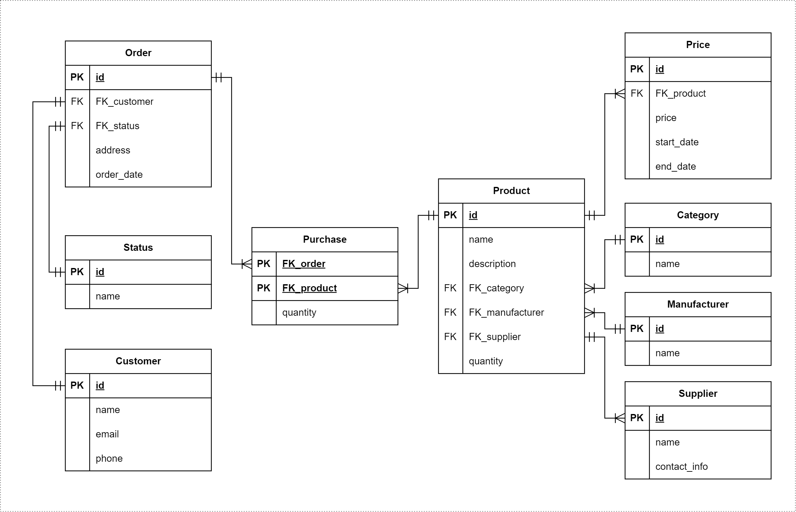

## Концептуальная модель базы данных для интернет-магазина
### Сущности:

##### 1. Продукты (Product):

- id (Primary Key)
- name (название продукта)
- description (описание продукта)
- FK_category (внешний ключ, связанный с таблицей Сategory)
- FK_manufacturer (внешний ключ, связанный с таблицей Manufacturer)
- FK_supplier (внешний ключ, связанный с таблицей Supplier)
- quantity (количество продукта)

##### 2. Категории продуктов (Сategory):

- id (Primary Key)
- name (название категории)

##### 3. Цены (Price):

- id (Primary Key)
- FK_product (внешний ключ, связанный с таблицей Product)
- price (цена продукта)
- start_date (дата начала действия цены)
- end_date (дата окончания действия цены)

##### 4. Поставщики (Supplier):

- id (Primary Key)
- name (название поставщика)
- contact_info (контактная информация)

##### 5. Производители (Manufacturer):

- id (Primary Key)
- name (название производителя)

##### 6. Покупатели (Customer):

- id (Primary Key)
- name (имя покупателя)
- email (электронная почта покупателя)
- phone (контактный телефон)
- address (адрес доставки)

##### 7. Покупки (Purchase):

- id (Primary Key)
- FK_customer (внешний ключ, связанный с таблицей Customer)
- FK_product (внешний ключ, связанный с таблицей Product)
- quantity (количество купленных продуктов)
- purchase_date (дата покупки)

### Связи:

Product.FK_category связан с Сategory.id

Product.FK_manufacturer связан с Manufacturer.id

Product.FK_supplier связан с Supplier.id

Price.FK_product связан с Product.id

Purchase.FK_customer связан с Customer.id

Purchase.FK_product связан с Product.id

### Бизнес-задачи:

1. Отслеживание товара:
   База данных помогает отслеживать количество продуктов в наличии и предотвращать нехватку товаров.

2. Ценообразование:
   Система цен позволяет управлять ценами на продукты в разные периоды времени и анализировать, какие цены наиболее эффективны.

3. Анализ покупок:
   Используя данные о покупках, можно проводить анализ предпочтений покупателей и формировать стратегии маркетинга.
   
5. Управление поставками:
   Отслеживание поставщиков и связанных с ними данных помогает эффективно управлять поставками и поддерживать сотрудничество с надежными поставщиками.

6. Профили покупателей:
   Хранение данных о покупателях позволяет создавать персонализированные предложения, учитывая предпочтения каждого клиента.

### ER-диаграмма:

